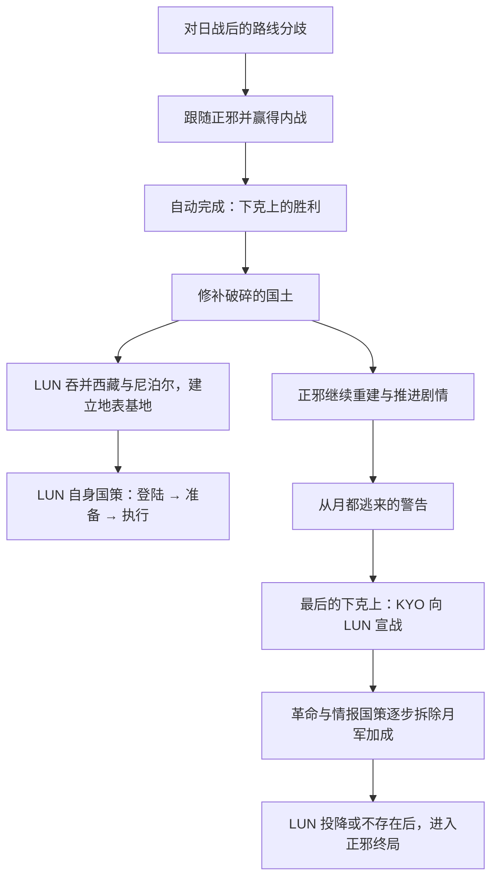

# 月之都现状调查与加强讨论基础

- 调查日期：2026-09-08。
- 开发主题：加强月之都（`LUN`）。
- 工作分支：`codex/renko-strengthen-lunar-capital`。
- 本地代码基线：`eaff13c9b553f328a974a0deec8e7a08bd834d9f`；本地描述符标注模组 1.0、适配 1.19.2.0。
- 状态：**已进入分段设计与实现准备；用户给出LUN轻量AI加强的整体方向并授权先做明确部分。本轮实施初次部队归属修正与山海补给初版，均待检验；完整实施计划见第19节。八云紫线仍单独处理。**
- 资料范围：本地幻想乡测试仓库的脚本和简体中文本地化；必要的地区名、建筑名、国策时长定义核对本机原版。本轮没有重新同步工坊，因此本报告不代表对最新工坊包的逐文件核验。
- 验证边界：未启动游戏，未检查存档或运行日志。下文区分脚本事实、剧情描述和仍需游戏核验的结果。

## 1. 先认识你准备加强的对象

**LUN 当前是依附幻想乡主线登场的地表入侵国家，主要在正邪路线承担后期敌人的角色。**它有自己的国策、领袖、科技和常驻加成，但独立国家内容相对集中：前三个国策负责集结、建设和扩大战争，后六个国策只有名称与耗时，完成奖励为空。玩家在正邪一侧拥有比 LUN 自身丰富得多的反抗、家庭身世、战争和结局剧情。

“月之都”这个名字在 MOD 中还指另外两层内容。先分清楚它们，才能理解哪些加强会实际影响 LUN：

| 层面 | 玩家看到的内容 | 实际承载者 | 与本次主题的关系 |
|---|---|---|---|
| 地图上的月军国家 | 西藏、尼泊尔一带出现月之都先遣队，集结军队，随后改名总部队并扩大战争 | `LUN` 的国策、国家配置及正邪线登场效果 | 本次加强的主要对象 |
| 八云线的地表月都战争 | 美英德苏法中符合条件的大国受控制，组成月都阵线与幻想乡交战 | 原有大国 TAG，以及 `KYO_lunar_campaign` 系统 | 是相关内容，但不会自动获得 LUN 的加强 |
| 剧情与月面战役 | 暗杀紫、命运天秤、第二次月面战争、月都重建 | KYO 的事件、决议、界面与变量 | 提供背景和另一种玩法；月面防卫值不是 LUN 陆军数值 |

新开局书签设在 1936 年，以幻想乡 KYO 为默认国家。LUN 没有作为书签推荐国家出现；本 MOD 自有地区历史也没有把土地开局交给 LUN。因此它不是通常从1936年直接经营起家的主角路线。其历史首都字段写着1082，而1082实际是开局归KYO的幻想乡；不能将这个字段当作一块已经存在的月球领土。[S1][S2]

## 2. 从未玩过的人会怎样理解这段故事

### 月都先是幕后敌人，后来才成为地图上的国家

对日战争及战后重建是幻想乡早期主线。月都对地上世界的干涉贯穿其中：对八云紫的观测和姬光炮攻击、永远亭与月面的旧关系、纯净和污秽的等级观念，都先通过剧情出现。

战后“命运的天秤”讲述宇佐见莲子秘密拆除月都观测链、设法保住八云紫的过程；后续事件存在按左右权重比较提供紫幸存或死亡选项的分歧。这阶段无需 LUN 在地上拥有军队。“月都发动攻击”是剧情描述，不能直接理解为 LUN 已宣战。[S3]

### 正邪路线：重建中的幻想乡面对月都殖民计划

正常路线可概括为：

图中两个分支表示双方各自推进国策，**不表示月军必须等到探女警告后才登场或扩军**。

- 路线选择事件“四道声音，四个未来”可以选择跟随正邪；内战胜利后的相关任务自动完成“下克上的胜利”，开启正邪主线。
- 随后的“修补破碎的国土”完成时，在隐藏效果中令 LUN 吞并西藏 `TIB` 和尼泊尔 `NEP`。这是按玩家国策进度触发，未写成某个固定年份的世界危机。
- 吞并的是这两个国家在当时的状态，不是固定写死的一组州。登场块未写显式迁都或新增核心；实际首都落点需要运行核验。
- 较晚的“从月都逃来的警告”才把探女带来的威胁详细讲给玩家；“最后的下克上”则实际令 KYO 向 LUN 宣战。[S4][S5]

正邪线里的月都希望把地球变为属领，保留城市、工厂、运输体系和愿意合作的旧政府，再建立等级统治。它不只是想把地球全部炸毁的抽象敌人。这是故事中的侵略目标，不能直接据此认定已实现一整套地图傀儡系统。

月都还连着正邪的个人身世：**本 MOD 设定**探女是正邪的母亲，为保护被月都认定不够纯净的孩子，抹去记忆并送她到地球。随后哆来咪通过梦境建立联络，正邪将反抗传播到月兔和占领区。这些都是本 MOD 的叙事，不应当作东方原作设定。[S6]

### 与普通流程分开的内容

仓库另有 `is_debug = yes` 的生成月军和重新分配世界领土国策，不能把这些测试入口并列为正常剧情。旧本地化还保留过“月之都入侵地球、幻想乡毁灭”的说法；当前同键新文本写远征总署成立，事件 `kyo_postwar.23` 实际只设置旗标，不吞地、不刷兵、不宣战。因此本调查以实际奖励为准，不把旧文本描述记成 LUN 的能力。[S7]

## 3. LUN 自己有什么国策

国策树共 **9 个国策，完全单线，无政治路线分叉**。本机原版每点国策成本为7天，MOD未覆盖这一项；下表是基础耗时换算，实际选择时机、空档及小数取整仍取决于运行结果。[S8]

| 顺序 | 中文名称 | 基础耗时 | 实际完成内容 |
|---|---|---:|---|
| 1 | 绝密计划：登陆 | 105天 | +1500万人力；+2界外军工、+2界外民工；在当前首都生成125个“Moon division”；阿里即时建设1个补给中心 |
| 2 | 绝密计划：准备 | 175天 | +5界外军工、+10界外民工；三段5级铁路、那曲和昌都的补给中心；日喀则建设和资源投入；对中国及满足中国国家判定的军阀势力发动吞并战争 |
| 3 | 绝密计划：执行 | 约365天 | 改名“月之都总部队”；+5界外军工、+10界外民工；向邻国宣战，再向除KYO外的主要国家宣战 |
| 4 | 来自月面的第一道讯息 | 70天 | 完成奖励为空 |
| 5 | 白色据点立于地表 | 63天 | 完成奖励为空 |
| 6 | 地表净化区 | 56天 | 完成奖励为空 |
| 7 | 向月都低头的人 | 49天 | 完成奖励为空 |
| 8 | 公主们的最后通牒 | 42天 | 完成奖励为空 |
| 9 | 你死，我活 | 35天 | 完成奖励为空 |

前三个国策若连续推进，基础累计约645天。这条线表现为“集结 → 中国方向战争 → 对外扩大”，而不是根据占领进度逐步开启下一阶段。当前奖励没有要求先打赢中国，才允许进行第三阶段。

第三个国策的两轮宣战应分别理解：**KYO只在主要国家那轮被排除，邻国那轮没有这一例外。**本轮没有找到专门规定 LUN 加入德国阵营的剧情脚本，不能把某一局中的阵营选择当成固定剧情。

后六个国策的描述文本也为空；在本仓库脚本中未发现另有通过它们完成状态触发的内容。它们有看起来逐步升级的名称，但目前不能记成六次增援、六个事件或六项机制。

## 4. 月军部队、科技和指挥官

### 4.1 确定写入自身国策的部队

“绝密计划：登陆”创建的模板内容如下：[S8]

| 项目 | 当前配置 |
|---|---|
| 名称 | `Moon division`，即月军师模板 |
| 线列营 | 9个山地步兵营 + 4个炮兵营 |
| 支援连 | 支援炮兵、游骑兵、防空、野战医院、后勤 |
| 模板管理 | 锁定，并写有允许招募的设置 |
| 一次生成量 | 125师 |
| 生成条件 | 当前首都；装备比例1.0、经验系数1 |

其军事形象是**带炮兵和完整支援的山地步兵集团**。国策使用原版营种；本轮没有发现 LUN 专属月人地面单位或专属步兵武器定义。剧情中的月面科技、光束和净化兵器，主要通过国家精神和故事表达，不能直接当作已经装备了某种独有超武。

**初次登场的100师单独说明：**正邪“修补破碎的国土”还写有一个同名模板和 `count = 100` 的生成块，但 `owner = ROOT` 位于 KYO 国策奖励内，LUN 只是嵌套作用域。这个归属写法需在游戏中核验；本报告不把它列为LUN确定得到的100师，也不宣称月军固定拥有225师。[S5]

国策刷兵是一次性投入。它未在同一奖励中为后续补损指定库存、生产线或周期性增援；损失后的补充和继续生产仍需观察实际国家运行。

### 4.2 初始科技和国家基础

LUN历史配置写有 **6科研槽、80%稳定度、95%战争支持度、法西斯执政且不举行选举**。科技覆盖陆海空、电子和工业，包括二代步兵武器、火车和卡车、三级机床、三级建造、三级分散工业、无线电与计算机，并按不同DLC分配飞机、坦克和舰船科技。[S2]

它还预先完成雷达和军事工程车辆特别项目，有对应DLC时完成直升机项目。不过“完成特别项目或拥有科技”不等于已经形成对应装备库存和有效战斗部队。

历史文件未加载陆军OOB；空军借用中国1936空军OOB的DLC对应版本。LUN三个实质国策没有专属舰队或机群生成。本轮没有展开所引用中国OOB的实际飞机数量，因此不据此宣称月都完全没有空军。

### 4.3 人物阵容

| 人物 | 当前角色 | 等级 | 攻击／防御／计划／后勤 |
|---|---|---:|---|
| 绵月丰姬 | 国家领袖、元帅 | 9 | 4／5／10／10 |
| 绵月依姬 | 元帅，带进攻学说和熟练参谋 | 9 | 9／9／6／5 |
| 铃仙二号 | 将军，突击队员 | 4 | 3／5／2／3 |
| 清兰 | 将军，突击队员 | 3 | 3／2／2／2 |
| 铃瑚 | 将军，后勤奇才 | 2 | 2／1／2／3 |

这些人物由国家历史招募，实际定义在 `common/characters/gensokyo.txt`。名为 `common/characters/LUN.txt` 的文件只是未被该历史招募的调试人物模板，不能当作真实阵容。[S9]

人物还定义了政治顾问、总司令和高级指挥部等岗位。**人物已招募不等于顾问已任命。**例如依姬政治顾问可提供陆军攻防各+20%，丰姬政治顾问可提供计划速度+10%等，但不能把这些可选岗位效果直接叠入开局常驻数值；AI是否任命、何时任命，需要观察。[S10]

## 5. 六个国家精神构成目前的强化底盘

以下六项由国家历史直接加入，而不是等待九个国策逐一解锁。名称按现有中文本地化转为简体；数值均为当前脚本，不是本轮建议值。[S2][S11]

| 国家精神 | 当前主要效果 |
|---|---|
| 月之头脑的遗产 | 科研速度+35%；加密、解密各+1；雷达站、火箭基地建造速度各+100%，核反应堆+50% |
| 绵月式统合军纪 | 陆军组织度和组织度恢复各+15%；增援率+2个百分点；计划速度+25%、最大计划+15%；经验损失−25%、训练时间−20% |
| 月球指挥网 | 协同+15%、侦察+20%、移动组织度损失−25%、陆军速度+10%、夜间攻击+15% |
| 天穹兵工体系 | 军工产出+20%、效率增长+20%、效率上限和基础效率各+15%；缺资源惩罚−25%、民工转军工成本−40% |
| 无尘战场规格 | 补给消耗−20%、损耗−15%、陆军燃油消耗−15%；补给中心和铁路建造速度各+40% |
| 净化兵器序列 | 陆军攻防各+15%、突破+20%；空军任务效率+15%、夜间惩罚−25%、制空战斗加成+15%；步兵装备软攻+10%、硬攻+15%、可靠性+15%；支援装备成本−10%、可靠性+20% |

因此当前月都已有科技、组织、指挥、生产、补给和直接战斗能力六方面的加成。它并非一张缺少强化的普通国家底板。但这些百分比也不能证明其在特定战场一定强大：实际装备、可用补给、战线配置及玩家后续削弱都会改变表现。

## 6. 工业、资源与补给具体从哪里来

### 工业投入

仅计算LUN三个国策自身，界外工厂累计为 **12军工、22民工**。这是额外于其吞并或占领所得工业的脚本投入，不能当作某个存档中的全国总工厂数。

“准备”另在日喀则757安排 **10军工、10民工、4级基础设施、1级大容量电网**，增加 **50钢、30煤**，并将地区类别设为大都市。四项建设均未写 `instant_build = yes`，所以不能说点完该国策就立刻拥有这20座工厂；可施工条件与完成时间需运行观察。[S8][S12]

### 补给投入

| 阶段 | 当前脚本安排 |
|---|---|
| 登陆完成 | 阿里758、省份10802即时建1个补给中心 |
| 准备完成 | 那曲322、省份2010与昌都601、省份8041各即时建1个补给中心 |
| 准备完成 | 铺设三段5级铁路：2010→2093→4994→5033；10802→8029→1991→8121→4994→5033；5033→10741→8041 |
| 全程常驻底盘 | “无尘战场规格”提供补给消耗−20%及铁路、补给中心建造速度加成；师模板带后勤连 |

当前已经有西藏地区的补给建设。它的流程是先在“登陆”生成125师并建阿里节点，再经过下一国策的基础175天，才建设其余铁路和节点。**何时形成军队、何时补齐运输网络，是两个不同阶段。**这些安排不能单独证明所有线路都实际建成、节点都有足够运力，或进入中国其他地区后仍有足够补给。

三个国策没有直接补充火车或卡车库存；有对应科技、模板带后勤连也不等于运输工具充足。后续需要从实际库存、摩托化、首都位置及战线展开判断。[S8]

## 7. 玩家在正邪一侧如何击败月都

除了正常地面作战，正邪有明确的剧情反制链：[S13]

| 正邪国策 | 对LUN的直接影响 |
|---|---|
| 最后的下克上 | KYO向LUN宣战 |
| 设立真理部 | 移除“月球指挥网” |
| 翻转主义 | 移除“天穹兵工体系”和“无尘战场规格” |
| 扭转月都的命运 | 移除“绵月式统合军纪” |
| 吾名正邪，生来就是天邪鬼 | 先要求LUN投降或不存在；之后转移LUN所有人物到KYO，并清除全部六项精神 |

这些削弱在故事里对应情报公开、革命传播、军心与统治体系瓦解。它们是现有玩家进程的一部分：**加强月都时，应先决定如何保留这条从强敌身上逐步拆掉优势的体验。**不能默认所有初始精神始终保留到终战。

正邪终局写到废除强制服役和血统等级、承认地球独立，正邪不成为月都的新主人。代码层面的最终国策并不直接吞并LUN，也没有在该段创建新月都政体；实际投降、和会归属和剧情改革应分别理解。[S6][S13]

## 8. 八云紫路线的“月都”另有一套完整玩法

这一节提供全MOD的内容背景，防止把它误算成LUN本体能力；本次加强主题仍以LUN为主。

### 地表战争

完成“再次站在月光下”后，系统安排 **730天**的入侵倒计时，最后六周逐步预告各国首脑被替换、广播和社会恐慌、月面武器与最后通牒。玩家也可通过“重启与月亮的战斗”抢先发动战争。[S14]

开战时，从美、英、德、苏、法中选择存在、仍为主要国家、未投降且不是KYO附属国的目标，建立“月都地表净化阵线”。**这些国家继续以原TAG和既有领土军队参战，不是全部并入LUN。**它们取得“月都垂治”系列加成，并按月面战局逐步削弱；幻想乡在月面取得第3胜后可触发扩大宣战，第4胜后美国可解除控制。地表目标投降或灭亡能提供“无偿令”，储存上限4。[S15]

### 第二次月面战争

完成“打开通往月面的间隙”并满足开战条件后，玩家在“月面决战指挥部”进行资源和战术操作：[S16]

- 每轮60天，进攻值从40开始。
- 20种战术中基础抽取5种，最多扩展到8种；追加第6／7／8项通常需25／40／60政治点。
- 战术花费不同装备、政治点、指挥点或经验；无偿令可替代资源支出。战术包含直接加值、条件加值与乘算等，使用顺序会影响进攻值。
- 防卫值根据难度、资源承受能力、地表解放情况、委员会状态、随机与比分等计算，**不是读取LUN的组织度、师数或工厂数**。
- 结算时进攻值严格大于防卫值才获胜，平手归月都；先到6胜获胜，最多11轮。
- 幻想乡六败后撤退90天并重新远征；这不等于直接消灭幻想乡国家。

月面胜利并完成地表解放，才能经后续国策进入“战争结束后的月都”及九阶段重建、秘封后日谈。剧情中的废除旧统治和重建月都，不应直接解释成LUN地图国家已被换政府或转交领土。当前重建决议每项14天；部分旧提示还写35天，本报告采用脚本值。[S17]

这套系统的核心文件没有直接引用LUN。修改LUN的六个精神或山地师，不会直接调整月面卡牌战的防卫值，也不会自动改变受控大国的“月都垂治”。

## 9. 为后续加强讨论建立现状边界

### 当前已经有的内容

- 正邪国策驱动的地表建国入口，西藏和尼泊尔基地。
- 九个单线国策，其中三个提供实际扩军、工业和战争推进。
- 预设科技、六科研槽、五名人物与两位9级元帅。
- 六个覆盖科研、军纪、指挥、工业、补给和兵器的国家精神。
- 125师国策生成、1500万人力、累计12界外军工和22界外民工，以及局部补给网络。
- 玩家能逐步剥离月军优势的正邪反制链。
- 与本体分开的八云地表世界大战、月面战术系统和后日谈。

### 本轮没有找到的LUN专属内容

- 独立的多分支内政、工业和军事国策路线；后六个讯息国策尚无完成奖励。
- 面向LUN玩家的专属决议分类和长期国家经营系统。
- LUN专属陆海空装备体系、独立海空军生成或固定周期增援。
- 在本仓库AI配置中针对LUN的独立国策计划、战区策略或生产模板。

这里的“没有找到”限定于本仓库和本轮检索，不表示国家完全不使用原版或通用AI。它的实际选策、外交、训练、生产、海空军运用仍由游戏运行决定。

### 后续讨论应基于什么

本轮不提出具体改数值方案。讨论加强时，可以依次确定以下目标，而不是先把所有加成加大：

1. **预期角色**：月都主要是正邪必须处理的区域强敌，还是能够自行形成世界危机的入侵者？现有宣战范围已经很大，两种体验需要的持续作战能力不同。
2. **阶段节奏**：希望玩家在重建时就看到月军基地，还是希望威胁随警告、集结和全面战争逐渐显现？目前登场跟随重建国策，军队与宣战跟随LUN自身国策。
3. **持续能力**：先观察当前部队是否能得到补给与补损、能否展开战线，再区分需要加强运输、工业、AI或单兵作战能力。
4. **反制价值**：保留正邪三步拆除指挥、工业补给、军纪的回报；需要讨论削弱前后分别应有多大威胁。
5. **后半程内容**：六个空奖励国策是否要成为持续发展的载体，需要单独确认内容目标，不能视为本轮已批准实施。

### 后续新开局观察记录

| 观察时点 | 需要记录的实际状态 | 用途 |
|---|---|---|
| LUN首次得到地盘 | 日期、触发国策、领土和首都、100师生成块的实际归属、人物与精神 | 确认真实出场底盘 |
| “登陆”完成 | 师数、模板、装备、经验、人力、工厂、首都拥挤与补给 | 确认125师投入如何转为实际力量 |
| “准备”完成 | 铁路节点实际建成情况、火车卡车、建设队列、宣战目标 | 了解持续推进能力 |
| “执行”完成 | 国名、战争与阵营、各战线和海空行动 | 了解世界扩张阶段 |
| 正邪三项反制前后 | 精神变化、月军战力及补给变化 | 衡量剧情反制的实际价值 |
| LUN战败后 | 领土处置、人物转移、正邪终局可用性 | 确认收尾体验 |

这些是后续验证清单，**本轮均未运行**；本报告不把静态分析写成已证实的战场表现。

## 10. 源码索引

以下行号对应本轮基线，修改脚本后应同步更新。路径相对仓库根目录；本机原版单独标明。

| 编号 | 来源与定位 | 支持内容 |
|---|---|---|
| S1 | `common/bookmarks/the_world_of_touhou.txt:4–11`；`common/country_tags/Gensokyo_countries.txt:12`；`history/states/1047-Gensokyo.txt:2–24` | 开局、TAG、1082所有权和核心 |
| S2 | `history/countries/LUN - Lunarians.txt:1–11,14–224,225–260` | 首都、人物、科技、国家初始值与六精神 |
| S3 | `common/scripted_effects/KYO_lunar_scale_effects.txt:4`；`events/KYO_after_war_events.txt:485–502`；`localisation/simp_chinese/zzz_KYO_lunar_scale_l_simp_chinese.yml:18` | 天秤、月都暗杀及生死分歧 |
| S4 | `events/gensokyo_post_war.txt:741–772`；`common/decisions/KYO_yukari_legacy_decisions.txt:3570–3616,3702–3708`；`common/national_focus/kyo-focus.txt:9355–9429` | 正邪路线入口与自动完成 |
| S5 | `common/national_focus/kyo-focus.txt:9449–9520,10695–10716`；`localisation/simp_chinese/focus_tree_l_simp_chinese.yml:732,845` | 吞并TIB/NEP、100师归属边界、探女警告 |
| S6 | `localisation/simp_chinese/events_gensokyo_second_seija_story_l_simp_chinese.yml:142–162,190–211` | 殖民计划、探女身世、革命与结局叙事 |
| S7 | `common/national_focus/kyo-focus.txt:886–903,1011–1020,1238–1261,1355–1364`；`events/gensokyo_post_war.txt:2992–3003`；`localisation/simp_chinese/zz_KYO_yukari_legacy_l_simp_chinese.yml:216–218` | 调试入口、只设旗标的远征总署事件 |
| S8 | `common/national_focus/luner-capital.txt:15–85,98–198,201–258,259–324`；`localisation/simp_chinese/focus_tree_l_simp_chinese.yml:1105–1131` | 九国策、军队、建设和宣战 |
| S9 | `common/characters/gensokyo.txt:1904–2003,2050–2191`；`common/characters/LUN.txt:3–48`；`localisation/simp_chinese/characters_gensokyo_l_simp_chinese.yml:279–280,336,347–348` | 人物数值和姓名、调试人物区别 |
| S10 | `common/country_leader/KYO_political_advisor_traits.txt:1309–1318,1811–1820` | 绵月姐妹可选政治顾问效果 |
| S11 | `common/ideas/difficulty.txt:152–303`；`localisation/simp_chinese/ideas_KYO_gensokyo-idea_l_simp_chinese.yml:557–573` | 六个常驻精神的当前数值及名称 |
| S12 | 本机原版 `common/defines/00_defines.lua:3598`；`common/scripted_triggers/CHI_scripted_triggers.txt:74–94`；`common/buildings/00_buildings.txt:735–751`；`localisation/simp_chinese/buildings_l_simp_chinese.yml:224`；`localisation/simp_chinese/state_names_l_simp_chinese.yml:464,748,919–920` | 国策换算、中国判定、大容量电网、地区名 |
| S13 | `common/national_focus/kyo-focus.txt:10778–10809,10863–10943,10950–11034`；`events/gensokyo_second_seija.txt:456–465`；`localisation/simp_chinese/focus_tree_l_simp_chinese.yml:865,880–892` | 正邪宣战、移除精神、终战门槛和人物转移 |
| S14 | `common/on_actions/KYO_lunar_campaign_on_actions.txt:2`；`common/scripted_effects/KYO_lunar_campaign_effects.txt:849–1024`；`common/national_focus/kyo-focus.txt:4991,6642–6655,6747–6766` | 八云730天倒计时、抢先开战与月面入口 |
| S15 | `common/scripted_effects/KYO_lunar_campaign_effects.txt:344–750,1060,1291–1459`；`common/ideas/KYO_lunar_campaign_ideas.txt:80–193` | 受控大国、独立TAG、月都垂治、解放与扩战 |
| S16 | `common/scripted_effects/KYO_lunar_campaign_effects.txt:1714–1908,1931–1934`；`common/decisions/KYO_lunar_campaign.txt:32–141`；`events/gensokyo_second_yakumo.txt:1165–1193` | 60天回合、抽牌、胜负与失败重开 |
| S17 | `common/national_focus/kyo-focus.txt:6770–6789`；`events/gensokyo_second_yakumo.txt:1037–1085`；`common/decisions/KYO_lunar_campaign.txt`后半重建决议；`localisation/simp_chinese/events_gensokyo_second_yakumo_l_simp_chinese.yml:464–542` | 月面胜利、地表解放及重建后日谈 |

本机原版根目录：`D:\SteamLibrary\steamapps\common\Hearts of Iron IV`。AI边界检索覆盖本仓库 `common/ai_areas`、`ai_equipment`、`ai_focuses`、`ai_strategy`、`ai_templates`；LUN直接引用调查覆盖 `common/`、`events/`、`history/`，并对照简体中文本地化。

## 11. 历史交接断点（2026-09-08，临时换设备；已续接，见第12—15节）

- 现状调查已完成并落盘；用户要求立即提交并推送工作分支。
- 恢复时先读本文第1、3、5、7、9节；下一步与用户讨论LUN加强目标和方案，不是默认继续排查Steam反馈，也不是直接改数值。
- 加强主题是LUN；八云线受控大国与月面数值战是独立内容，未获准一并改造。
- 初次登场100师的owner=ROOT、实际首都、建设落地及战斗表现仍待新开局核验；不能直接宣称LUN实得225师。
- 本轮无玩法修改。后续以新开局为基线；未经明确批准不新增或扩展on_daily/on_monthly；新增文件和标识符使用Renko前缀。
- 每轮提交前先写development_logs，日志与改动一并提交；根AGENTS.md按本地规则排除，不随Git传输，关键约束在此留存供续接。
- 本地未跟踪的descriptor.mod、工坊补齐图像及local_workshop_audit.json保留原状，不纳入本次文档提交。

## 12. 已确认改革范围与时间结构（2026-09-08续接）

### 12.1 用户已确认的边界

- 改革对象仅为地图国家月之都 `LUN`；用户计划进行大幅改革，并说明已获授权修改月都国策。
- 用户要求涉及宣战的关键节点与原来对齐，不改变原有时间结构；本轮只登记与调查，尚未批准任何具体奖励或机制实现。
- 八云紫线的受控大国、月面数值战与重建系统不属于本次LUN改革范围。
- 下列工期是基础国策成本换算，不是固定日历、保证触发日期或实机测量。

### 12.2 LUN何时出现

正常正邪路线：内战胜利后的相关任务自动完成“下克上的胜利” `KYO_Seija_start`，随后完成“修补破碎的国土” `KYO_rebuild_the_broken_land`，在完成奖励中令LUN吞并当时的TIB和NEP。

- “修补破碎的国土”成本5，即35天；若玩家立即推进，可按该国策35天基础工期理解登场间隔。
- “下克上的胜利”自身成本6，即42天，但上述正常流程是自动完成，不应再加42天。
- 登场不绑定某个年份；对日战争、内战和选策进度都会改变日历日期。
- 同一登场奖励中的100师归属仍有疑点；领土登场与部队实际生成结果分开记录。

来源：`common/decisions/KYO_yukari_legacy_decisions.txt:3702–3708`；`common/national_focus/kyo-focus.txt:9355–9358,9449–9520`。

### 12.3 双方关键时间表

定义T为LUN获得地表领土的时点。以下假设各自连续推进所需国策，未扣储存进度，未加入AI选策空档等运行因素；LUN以登场即开始首个国策作为对照起点。

| 节点 | 相对T的基础工期 | 脚本内容 |
|---|---:|---|
| LUN登场 | T | 吞并西藏、尼泊尔；创建模板及执行有归属疑点的100师生成块 |
| 绝密计划：登陆 | T+105天 | 成本15；125师、1500万人力、界外工厂及阿里补给节点 |
| 绝密计划：准备 | T+280天 | 再花175天，累计成本40；对中国及符合中国判定的军阀宣战 |
| 绝密计划：执行 | T+645.05天，约645天 | 再花365.05天，累计成本92.15；向邻国及除KYO外的主要国家宣战，改名总部队 |
| 正邪：从月都逃来的警告 | T+1085天 | 登场后最短所需31个成本5的国策，合计155点；警告剧情和相关解锁 |
| 正邪：最后的下克上 | T+1225天 | 登场后最短所需35个成本5的国策，合计175点；KYO主动向LUN宣战 |

正邪前置核算：三条人物分支各选一条互斥选项，各需6项，共18项；汇合1项；工业与理论分支各5项，共10项；再次汇合1项；警告1项，共31项。随后完成三项治理国策和宣战国策，共35项。各互斥选择工期相同。多个独立prerequisite块要求分别满足，不能只计算最长的一条分支。针对相关前置未找到额外的自动完成调用；未进行游戏运行验证。

重要区别：

- 正邪的警告与宣战走KYO自己的进度，LUN不等待它们才扩军或扩大战争。
- T+1225天是正邪这条国策的基础主动宣战节点，不是双方最早开战时间。
- LUN“执行”的邻国宣战没有排除KYO；若当时接壤，可以先行攻击KYO。阵营战争等也可能影响实际参战时点。
- “执行”没有先打赢中国、整补完成或后勤就绪的门槛；改革若新增此类条件，也会改变原时间结构，不能作为未经讨论的常规修正。

来源：`common/national_focus/luner-capital.txt:15–258`；`common/national_focus/kyo-focus.txt:9545–10809`；本机原版 `common/defines/00_defines.lua:3598`，`FOCUS_POINT_DAYS = 7`，本MOD未覆盖该项。

### 12.4 将时间约束用于后续国策设计

以下为对用户时间要求的实施约束整理，未编写游戏代码：

- 保留“修补破碎的国土”的登场入口。
- 对华宣战前累计成本保持40点，即280天；扩大宣战前累计保持92.15点，即645.05天；两次宣战之间保持52.15点，即365.05天。
- 可在原工期内拆分新国策、重排奖励；不能直接插入额外必经工期。
- 新增可选支线也可能让AI绕路、推迟宣战；后续必须同时考虑选择顺序，单独保持主线成本不足以保证节奏。
- 扩大宣战后的六项空奖励国策合计45点，即315天；在其原位置补充内容不会直接增加前两次宣战的前置工期。
- 是否保留105天扩军节点及如何分配阶段奖励，尚待方案讨论；不得将用户保留宣战节奏理解为所有原奖励和数值都必须不动。

## 13. 改革可利用的现有素材

这里记录可用库存与适用方向，不代表已经选定或授权实现。剧情采用本MOD设定，不当作东方原作事实。

| 类别 | 已有素材 | 用途与边界 |
|---|---|---|
| 月都统治与侵略叙事 | 纯净与污秽等级、月人贵族、月兔服役、地球属领计划、地表工业与合作政府 | 国家定位、占领政策、政治与军事国策文案；剧情不等于已实现机制 |
| 内部矛盾 | 月兔反抗、运输倒戈、情报泄露、忠诚审查、贵族内斗 | 战时危机及正邪反制后的表现；需维护原有反制链的含义 |
| LUN人物 | 丰姬、依姬、铃仙二号、清兰、铃瑚；已有领袖、将领及顾问岗位 | 统帅与部门人物基础；招募不等于任命全部顾问 |
| 相关人物 | 探女、哆来咪、铃仙等现有角色与文案 | 情报、梦境联络、月兔与地上关系；不是默认可转移给LUN的人物名单 |
| 六个常驻精神 | 科研、军纪、指挥网、兵工、后勤、净化兵器 | 能力分类与现有脚本基础；四项会被正邪国策逐步移除，终局清除六项 |
| 军事与工业实现 | 月军模板、生成部队、人力、界外工厂、西藏建设、铁路、资源、宣战 | 阶段奖励参考；先处理归属、持续补损等已发现问题 |
| 国家外观 | LUN大中小三种旗帜、先遣队和总部队名称配置 | 国家识别与阶段变化 |
| 人物图像 | 五名LUN人物的大头像及顾问头像；丰姬、依姬另有替换头像；探女、哆来咪等也有图像 | 人物、顾问及事件选材；已核文件与注册，未逐张做视觉筛选 |
| 国策与精神图标 | 月之子、月都档案、探女等相关国策图；月都阴谋与月人企业图 | 初版图标库存；现有六精神实际使用原版通用图标，并无六张专属月都配图 |
| 月面界面资产 | 月面背景、战术卡、报告面板、命运天秤、第二次月面战争超级事件图 | 可挑选视觉素材；既有GUI与数值系统属于KYO，不是LUN现成玩法 |

### 13.1 来源入口

- 人物定义：`common/characters/gensokyo.txt`；初始招募：`history/countries/LUN - Lunarians.txt:7–11`。`common/characters/LUN.txt`是调试人物模板，不当作正式五人阵容。
- 人物图像：`gfx/characters/gensokyo/`，文件名前缀包括 `gensokyo_toyohime`、`gensokyo_yorihime`、`gensokyo_reisen_2`、`gensokyo_seiran`、`gensokyo_ringo`；替换图位于 `gfx/characters/gensokyo_alternative/`。注册位于 `interface/characters_gensokyo.gfx`。
- 国策脚本：`common/national_focus/luner-capital.txt`；文案：`localisation/simp_chinese/focus_tree_l_simp_chinese.yml:1105–1131`。
- 国策图像：`gfx/interface/goals/KYO/`，包括 `KYO_child_of_moon_enemy_of_earth.png`、`names_in_lunar_archives.png`、`sagume_does_not_deny_it.png`；注册位于 `interface/Gemsokyo_focus_customicons.gfx`。
- 精神：`common/ideas/difficulty.txt:152–303`；图像还可查 `gfx/interface/ideas/lunar_capital_plot.png`、`gfx/interface/ideas/companies/company_lunarian.png`。
- 剧情：`localisation/simp_chinese/events_gensokyo_second_seija_story_l_simp_chinese.yml:142–213`；对应事件 `events/gensokyo_second_seija.txt`。
- 国旗：`gfx/flags/LUN.tga`、`gfx/flags/medium/LUN.tga`、`gfx/flags/small/LUN.tga`。
- 月面界面注册：`interface/KYO_lunar_campaign.gfx`、`interface/KYO_lunar_scale.gfx`；超级事件图 `gfx/sp_events/Yukari_path_second_moon_war.png`。

### 13.2 当前缺口

- 后六个国策没有奖励和描述，不能将名称当作已有的六项机制。
- 没有完整的LUN专属经营、海空军建设或独有装备体系；需要另行设计，不是简单调用现成系统。
- 现有图像只核对路径与注册，不代表已确认其画面、风格、尺寸或适配效果；部分人物图像来自本地工坊补齐的未跟踪资产，不应因写计划而自动纳入提交。
- 复用素材不意味着迁移八云线系统；新增LUN内容仍须保持与其他路线的实现边界。

## 14. 续查补充：出场、科技、空军与补损

- 初次100师：模板创建在LUN作用域，`owner = ROOT`却位于KYO国策奖励中，存在归属不一致；没有运行证据，不计入LUN确定师数。
- 空军：LUN引用原版 `CHI_1936_air_bba` 和 `CHI_1936_air_legacy`。文件内机翼所有者均明确为CHI，部署在中国地区；两文件分别列132架、115架，但这些不能算作LUN实际拥有的空军。旧式文件还含生产设置，因此不能概括为完全没有任何生产相关入口；LUN三国策本身没有专门配置补损生产线。
- 科技：LUN历史未列 `tech_mountaineers`、`tech_field_hospital`、`tech_logistics_company`，模板却包含相应单位；游骑兵也需另核解锁来源。通用AI山地模板在缺山地科技时将升级优先级归零。这是初始配置不配套的证据，不是已证实现有师不能补员或补装备。
- 按本机原版单位基础需求，月军9山地+4炮兵与五支援模板，每师仅以下四类就需步兵装备1300、火炮108、支援装备65、卡车30；125师合计162500、13500、8125、3750。尚未计入防空炮和补给网络用车；这是满编需求，不是库存、每日消耗或新增建议值。
- 计算依据：山地每营140步兵装备；游骑兵40步兵装备+15支援装备；线列炮兵每营24火炮、支援炮兵12火炮；医院30支援装备+20卡车；后勤20支援装备+10卡车。
- 125师满装备生成与后续补损是不同问题；1500万人力不能替代枪炮、卡车和运输工具。新增生产、库存与运输方案尚未制定。

来源：本机原版 `history/units/CHI_1936_air_bba.txt`、`CHI_1936_air_legacy.txt`；`common/units/infantry.txt:246–303`、`recon.txt:444–521`、`artillery_brigade.txt:28–29`、`artillery.txt:31–32`、`field_hospital.txt:56–59`、`logistics.txt:51–54`；本MOD `common/ai_templates/mountaineers.txt:8–13`。

## 15. 八云紫线中月都与LUN的地位

**故事层面，月都也是八云紫线的后期主要敌人；机制层面，主要敌人不是LUN国家，而是受控地表大国和独立月面战役。**

| 对照项 | 正邪线 | 八云紫线 |
|---|---|---|
| 地表敌人的承载者 | LUN国家，西藏和尼泊尔基地 | 符合条件的美、英、德、苏、法等原有国家 |
| 战争推进 | LUN前三个国策，另有KYO主动宣战国策 | “再次站在月光下”安排730天倒计时，也可抢先发动 |
| 敌军能力来源 | LUN科技、人物、六精神、模板与工业 | 受控国家既有实力及“月都垂治”等加成 |
| 月都本土对抗 | 正邪剧情反制与终局事件 | 60天一轮的月面战术数值对抗，先取得6胜 |
| 结束条件 | 正邪终局要求LUN投降或不存在 | 月面胜利旗标与地表解放完成旗标共同解锁后续重建 |
| LUN改革的直接影响 | 直接改变主要地表敌人 | 不会自动改变受控国家加成或月面防卫值 |

八云线流程说明：

1. 月都从幕后干涉和暗杀威胁，发展为地表世界战争的主导势力。
2. 地表开战时选择存在、仍是主要国家、未投降且非KYO附属国的目标，设置月都控制标记，重组阵线；各国保留自身TAG、领土和军队，不是全部吞并给LUN。
3. 月面战役由KYO操作战术和资源，月面取胜会削弱地表控制与加成，两条战线存在联动；这些数值没有读取LUN的师数、工厂或六精神。
4. 月面6胜并完成地表解放后，经“战争结束后的月都”进入重建与后日谈；不是检查LUN投降来代替这两个目标。

本次在 `common/scripted_effects/KYO_lunar_campaign_effects.txt`、`common/decisions/KYO_lunar_campaign.txt`、`events/gensokyo_second_yakumo.txt`、`common/scripted_triggers/KYO_lunar_campaign_triggers.txt` 检索未发现直接LUN引用。结合正常登场入口，可确认八云核心系统并不以生成LUN或打败LUN为必要条件；不将其扩大为“任何异常流程下LUN都绝对不可能出现”。

来源：`common/scripted_effects/KYO_lunar_campaign_effects.txt:344–537,849–867,1874–1908`；`common/national_focus/kyo-focus.txt:4991,6653–6655,6770–6789`。

本次仅更新调查与计划，未修改玩法、未提交或推送、未启动游戏。后续恢复以第12节的已确认时间约束为准；具体改革内容仍待用户确定。

## 16. 作者建议与用户确认的后续分工

- 日期：2026-09-08。来源为用户提供的作者聊天截图；以下是建议内容的转述，不把附件中的建议当作直接执行指令。

### 16.1 作者建议（参考，未实施）

- 正邪线LUN：从西藏高原生成，推进到特定国策后向周边开战；希望能够占领较大面积的土地，避免大量部队困在高原无法推进，体现月之都的威胁。
- 八云紫线受控大国：月都阵营的主要国家积极扩张；如果月都在第二次月面战争的决议对抗中失利，则转向战略收缩。
- 截图提到了AI_strategy，但没有给出具体策略类型、目标地区、数值、触发与退出条件；不能据此认定现有实现已经具备上述能力。
- “月面失利”究竟指单轮失败、累计败局还是整场战争失败，以及“战略收缩”如何表现，均尚未确定。

### 16.2 用户确认的工作分工

- 正邪线：后续由用户安排具体方案，按常规AI国家的思路编写LUN加强；当前不直接实施国策、军队、生产或AI策略改动。
- 保留第12节已确认的登场与宣战时间结构；作者希望扩大地表威胁，不等于批准改变宣战日期或目标范围。
- 八云紫线：另作处理，用户需要先判断作者方向是否可行；本次不启动该系统的改造，也不与LUN加强合并为一套实现。
- 两条线的实现对象不同：LUN是地图国家；八云线主要是受控大国及KYO月面系统。后续可借鉴通用AI编写经验，但分别定义目标、条件与验证边界。

状态：仅记录方向与分工，具体设计与可行性结论待后续安排，未实施、未实机验证。

## 17. 编写时检查与原MOD的衔接

- 用户新增要求：后续编写LUN加强时，需要检查实现是否与原MOD脱节；作为编写过程中的必要检查项，不只在完成后检查。
- 对照原MOD现有剧情、人物定位、国策与事件依赖、登场及宣战节奏、正邪削弱与终局链，确认新内容能够衔接，避免出现剧情矛盾、重复奖励、触发断链或旧反制失效。
- 大幅改革不等于保留所有旧逻辑；如需有意改变既有衔接，应明确列出原行为、新行为及影响范围，纳入用户方案讨论，不默默改变。
- 本条仅记录后续编写要求，不代表已经完成衔接审查，也不新增玩法或实机测试安排。

## 18. 原作设定参考入口

已新增[月之都与相关人物设定参考](Renko_月之都与相关人物设定参考.md)，整理月都世界观、五名LUN人物及关联人物、后续作品补充和来源。该文件区分原作转录、资料站整理、本MOD设定与创作提示，并记录网页抓取边界；使用时遵守第17节的衔接要求，不自动改变本MOD已有改编或扩大八云线工作范围。

## 19. 轻量AI加强整体方案与分段实施

用户已提出完整方向并授权先做边界明确的部分、随后审核代码。新增[轻量AI加强分段实施计划](Renko_LUN轻量AI加强分段实施计划.md)，完整记录补给、运营占领、人力、月兔兵种与装甲、两种编制、生产、超级MIO、陆空设计、科技期限和专属学说，并列依赖关系、源案例、待定选择与原MOD衔接点。

本轮实现初次100师owner由ROOT改为LUN，并接入一次性亚洲/中东当地补给100、LUN补给范围+1000%、拥有日喀则时设置地表首都及正邪反制/终局清理，均待检验。此前归属未修正等表述保留为历史调查；最新状态以实施计划第12节为准。未调整国策工期、宣战目标或顾问。用户最新确认：接受地区补给敌我共享；科技保底按日历年份；允许助手按简单原则裁断并记录关键决定，不再提问。
